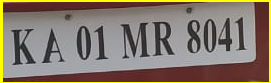

# Autometic Number Plate Detection
## Overview
This is a Flask app based project, which detect numberplates of vehicles.
## Technologies
Convolution Neural Network, Tensorflow-2.x, Easyocr, Opencv.
## FrameWork
Tensorflow Object Detection 
## Models
SSD-MobileNet
## Description
At first we download the model from tensorflow model garden and trained in separate notebook on our custom car data for 10000 epochs.
Then using the latest checkpoint we can detect the number plate accurately.
After detecting the numberplate we only take the necessary portion of image i.e., the numberplate portion.
applying easyocr we extract the text in the numberplate and give it to you.
Here we use html in frontend. We have to upload the car image or video for which we want to know the numberplate.
We created separate input and output directory where our input file and cropped output image will be saved.

## Project Demo
#### See my project here
[Demo](https://www.linkedin.com/posts/arnab-mitra-882756227_deeplearning-ai-computervision-activity-6937754713140379648-kQ0C?utm_source=linkedin_share&utm_medium=member_desktop_web)

## Our input page is

## Our output page is 

## Sample output image is

